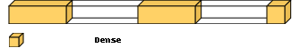

# | DNN | WINE | Prediction |
## Dense Neural Network (DNN) for Wine Quality Prediction

# <b>Introduction</b>

In this notebook, we employ a Dense Neural Network (DNN) to perform a prediction task on the renowned Wine Quality dataset.

The [Wine Quality dataset](https://archive.ics.uci.edu/ml/datasets/wine+Quality), comprised of extensive wine analyses, assigns each wine a quality score between 0 and 10. Credit for the dataset goes to [Paulo Cortez](http://www3.dsi.uminho.pt/pcortez) from the University of Minho, Guimarães, Portugal. You can access this dataset from the [University of California Irvine (UCI) Machine Learning Repository](https://archive-beta.ics.uci.edu/ml/datasets/wine+quality).

The dataset, due to privacy and logistical issues, only contains physicochemical and sensory variables. Aspects such as grape types, wine brands, and selling prices are excluded. The dataset includes the following features:

- Fixed acidity
- Volatile acidity
- Citric acid
- Residual sugar
- Chlorides
- Free sulfur dioxide
- Total sulfur dioxide
- Density
- pH
- Sulphates
- Alcohol
- Quality (score between 0 and 10)

The notebook is structured into the following sections:

## Objective:
- Our primary aim is to predict wine quality based on the provided analysis data using a simple Dense Neural Network (DNN).
- Testing the a simple DNN model.
- The aim is not only to achieve high predictive accuracy but also to create a model that is computationally efficient and easily interpretable, offering valuable insights into the relationships between physicochemical properties and wine quality.

## Steps:
1. **Imports, Constants, & Methods**: Set up the necessary libraries, constants, and methods for the task.
2. **Data Retrieval**: Fetch the Wine Quality dataset from the provided source.
3. **Data Preparation**: Conduct necessary preprocessing and data cleaning activities on the dataset.
4. **Model Creation**: Design and establish a Dense Neural Network (DNN) for predicting wine quality.
5. **Model Training & Saving**: Train the DNN on the prepared dataset and store the trained model for future reference.
6. **Model Evaluation**: Gauge the performance of the trained model by evaluating its predictions against the test data.
7. **Best Model Evaluation & Prediction**: Assess the performance of the best model saved during training, by evaluating its predictions on test data. And Use the best-trained model to generate predictions on new, unseen wine data.

# Project:
- [Github](https://github.com/YanSteph/DNN-Wine-quality-prediction-with-a-Dense-Network/blob/main/dnn-wine-wine-quality-prediction-with-dnn.ipynb)
- [Kaggle](https://www.kaggle.com/code/yannicksteph/dnn-wine-wine-quality-prediction-with-dnn)
